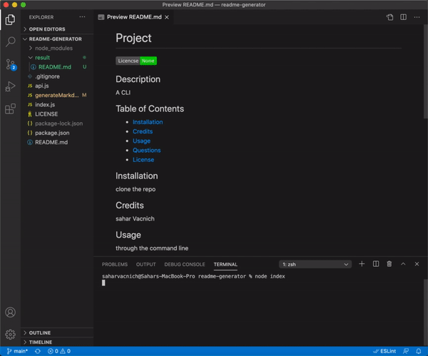

# README Generator
  

  ## Description
  An easily navigable CLI that takes user input to put together README for your project

  ## Langauges
  JavaScript

  ## Table of Contents
  - [Installation](#Installation)
  - [Credits](#Credits)
  - [Usage](#Usage)
  - [Questions](#Questions)
  - [License](#License)

  ## Installation
  Clone it locally, run "npm install", then "node index" and follow the instructions

  ## Credits
  Sahar Vacnich

  ## Usage
  run "node index" and follow the instructions

  ## Testing
  no tests yet

  ## Questions
  [link to my GitHub!](https://github.com/saharVac)
  [Email me!](mailto:vcsahar@gmail.com)
  

  ## License
  None

  
  
